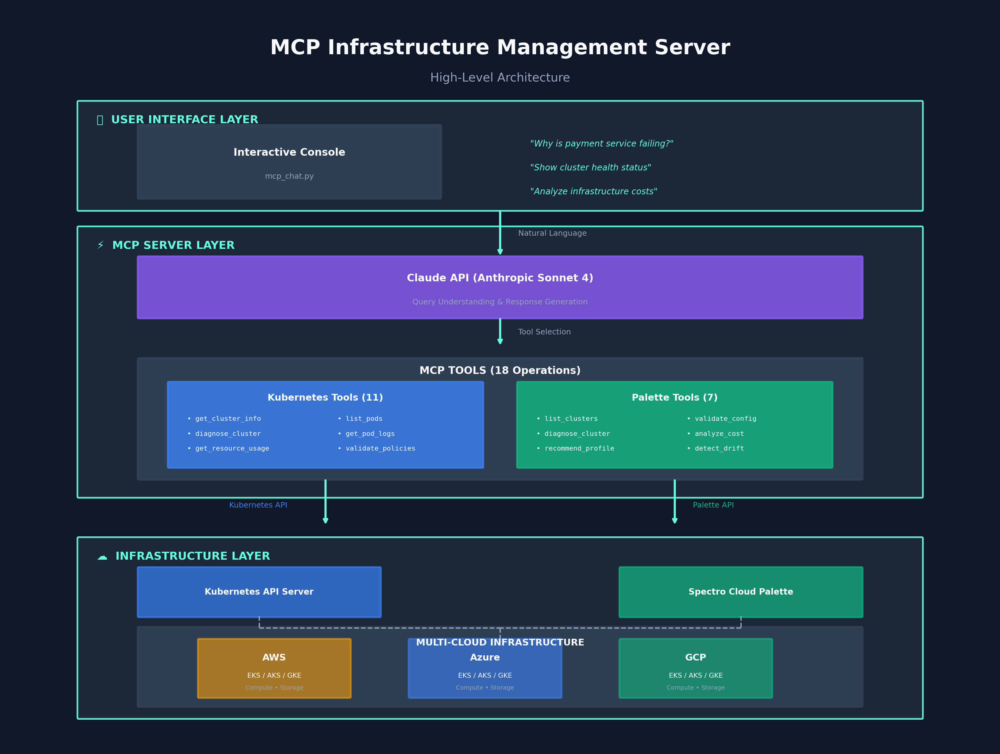

# MCP Infrastructure Management Server

Model Context Protocol server implementation for Kubernetes and Spectro Cloud Palette infrastructure operations.

---

## Why This Project

This project was created to demonstrate practical expertise in areas directly relevant to the **AI Engineer role at Spectro Cloud**:

| Job Requirement | Demonstrated In This Project |
|-----------------|------------------------------|
| MCP server development | Two fully functional MCP servers (Kubernetes + Palette) |
| Agentic systems | AI-powered diagnostic tools with automated recommendations |
| AI guardrails & governance | Policy engine with prompt validation, action validation, approval workflows |
| Python proficiency | ~3,000+ lines of well-structured, typed Python |
| Kubernetes experience | 11 K8s operational tools with real cluster integration |
| CI/CD experience | GitHub Actions pipeline with testing, linting, security scanning |
| Understanding of Spectro Cloud | Palette MCP server modeling real API structure and cluster profiles |
| Project management | Modular architecture, comprehensive documentation, test coverage |

**Note:** The Palette MCP server operates in demo mode with mock data, demonstrating the architecture and integration patterns that would connect to the real Palette API with proper credentials.

---

## Overview

This project implements MCP (Model Context Protocol) servers for managing cloud-native infrastructure through programmatic interfaces. The implementation includes two variants:

- **Kubernetes MCP Server**: Production-ready server for Kubernetes cluster management
- **Palette MCP Server**: Spectro Cloud Palette integration for multi-cloud operations (demo mode)

## Architecture

The system uses MCP to expose infrastructure operations as callable tools, enabling automation, monitoring, and management workflows.



*Three-layer architecture: User Interface (Interactive Console) → MCP Server Layer (Claude API + 22 Tools) → Infrastructure Layer (Multi-Cloud)*

### Components

```
mcp-infrastructure-ai/
├── k8s-mcp-live/              # Kubernetes MCP implementation
│   ├── mcp_server.py          # Core server with 11 operational tools
│   ├── demo_cli.py            # Command-line interface
│   └── setup_demo.sh          # Environment setup script
│
├── palette-mcp/               # Palette MCP implementation
│   ├── mcp_server/            # Server core
│   │   ├── palette_mcp.py     # Main server (11 tools + 2 resources)
│   │   ├── config.py          # Configuration management
│   │   └── tools/             # Tool implementations
│   │       ├── cluster_tools.py
│   │       ├── profile_tools.py
│   │       └── diagnostic_tools.py
│   │
│   └── guardrails/            # AI Governance Layer
│       ├── policy_engine.py   # Policy enforcement & validation
│       └── policies/
│           └── security.yaml  # 17 security rules
│
├── mcp_chat.py                # Interactive demo console
├── tests/                     # Test suite (21 test cases)
└── .github/workflows/         # CI/CD pipeline
```

## Quick Start

### Prerequisites

- Python 3.9+
- kubectl configured (for Kubernetes variant)
- Kubernetes cluster access (minikube, kind, or cloud provider)

### Installation

```bash
# Clone repository
git clone <repository-url>
cd mcp-infrastructure-ai

# Install dependencies
pip install -r requirements.txt
```

### Running Kubernetes MCP Server

```bash
# 1. Start a Kubernetes cluster
minikube start
# or
kind create cluster --name mcp-demo

# 2. Deploy sample workloads
cd k8s-mcp-live
./setup_demo.sh

# 3. Start MCP server
python mcp_server.py
```

### Running Palette MCP Server (Demo Mode)

```bash
cd palette-mcp
python -m mcp_server.palette_mcp
```

### Running Interactive Console

```bash
# Requires ANTHROPIC_API_KEY
python mcp_chat.py
```

## Features

### Kubernetes MCP Server

**Cluster Operations**
- Cluster information retrieval
- Node status monitoring
- Namespace management
- Resource inventory

**Workload Management**
- Pod lifecycle operations
- Deployment status tracking
- Service discovery
- Event monitoring

**Diagnostics & Analysis**
- Automated health checks
- Issue detection and classification
- Resource utilization analysis
- Performance metrics

### Palette MCP Server

**Multi-Cloud Management**
- Cluster lifecycle operations
- Cross-cloud resource management
- Unified monitoring interface

**Cluster Profiles**
- Profile application and management
- Configuration drift detection
- Pack version tracking

**AI-Powered Diagnostics**
- Automated cluster diagnosis with health scoring
- Profile recommendations based on workload descriptions
- Configuration validation against governance policies
- Cross-cluster comparison for drift detection

### AI Guardrails & Governance

The `guardrails/` module implements enterprise AI safety controls:

**Policy Engine**
- YAML-based policy definitions
- Rule evaluation against actions/configurations
- Approval workflow triggers
- Audit trail generation

**Prompt Validator**
- Injection attack detection
- Out-of-scope request filtering
- Blocked pattern matching

**Action Validator**
- Destructive action controls
- Resource limit enforcement
- Production environment protection

```python
# Example: Validating an action against policies
from guardrails.policy_engine import PolicyEngine, ActionValidator

engine = PolicyEngine()
validator = ActionValidator(engine)

action = {
    "type": "create_cluster",
    "node_count": 15,
    "gpu_enabled": True
}

result = validator.validate(action)
# result.requires_approval = True (GPU + high node count)
```

## MCP Tools Reference

### Kubernetes Server Tools (11 tools)

| Tool | Description |
|------|-------------|
| `get_cluster_info` | Retrieve cluster metadata and status |
| `list_pods` | List pods across namespaces |
| `list_deployments` | Get deployment status |
| `get_node_status` | Check node health and capacity |
| `diagnose_cluster` | Run comprehensive health analysis |
| `get_resource_usage` | Analyze resource allocation |
| `describe_pod` | Get detailed pod information |
| `get_pod_logs` | Retrieve container logs |
| `get_pod_events` | Fetch pod lifecycle events |
| `list_services` | Service discovery |
| `list_namespaces` | List available namespaces |

### Palette Server Tools (11 tools + 2 resources)

| Tool | Description |
|------|-------------|
| `list_clusters` | Get managed clusters inventory |
| `get_cluster_details` | Detailed cluster information |
| `get_cluster_events` | Retrieve cluster events by severity |
| `get_cluster_cost` | Cost analysis and optimization |
| `list_cluster_profiles` | Available profile catalog |
| `get_profile_details` | Profile configuration details |
| `list_available_packs` | Registry pack listing |
| `diagnose_cluster` | AI-powered health analysis |
| `recommend_profile` | Workload-based profile suggestions |
| `validate_configuration` | Policy compliance validation |
| `compare_clusters` | Cross-cluster diff analysis |

**Resources:**
- `palette://clusters` - Real-time cluster status summary
- `palette://profiles` - Profile catalog for AI context

## Configuration

### Environment Variables

```bash
# Palette API credentials (optional - runs in demo mode without)
export PALETTE_API_KEY="your-api-key"
export PALETTE_PROJECT_UID="project-uid"

# For interactive console
export ANTHROPIC_API_KEY="your-key"
```

### Kubernetes Access

Ensure kubectl is configured:

```bash
kubectl cluster-info
kubectl get nodes
```

## Development

### Running Tests

```bash
pytest tests/ -v
```

### Test Coverage

The test suite includes 21 test cases covering:
- Configuration management
- Cluster tools operations
- Diagnostic tools functionality
- Policy engine validation
- Prompt injection detection
- Action validation workflows

### Adding New Tools

1. Implement tool function in appropriate module
2. Register with MCP server using `@mcp.tool()` decorator
3. Add type hints and documentation
4. Write tests

Example:

```python
@mcp.tool()
async def new_tool(param: str) -> dict:
    """
    Tool description for documentation.

    Args:
        param: Parameter description

    Returns:
        Result dictionary
    """
    # Implementation
    return result
```

### Policy Configuration

Edit `palette-mcp/guardrails/policies/security.yaml` to define custom policies:

```yaml
policies:
  - name: require-resource-limits
    severity: medium
    check: resources.limits
    message: Containers must define resource limits
```

## CI/CD Pipeline

The GitHub Actions workflow includes:

- **Code Quality**: Ruff linting, Black formatting, mypy type checking
- **Unit Tests**: pytest with coverage reporting
- **Security Scanning**: Trivy vulnerability scanner, Snyk analysis
- **Container Build**: Docker image with GitHub Container Registry
- **Integration Tests**: End-to-end testing (when credentials available)

## Production Considerations

### Security

- Use read-only API credentials where possible
- Enable audit logging
- Implement rate limiting
- Secure credential storage
- Network policy enforcement

### Scaling

- Deploy as containerized service
- Use connection pooling for API clients
- Implement caching layer
- Set up monitoring and alerting

## Integration Examples

### Automation Workflows

```python
from mcp_server import tools

# Automated cluster health check
health = await tools.diagnose_cluster()
if health['score'] < 80:
    send_alert(health['issues'])
```

### CI/CD Pipeline

```bash
# Pre-deployment validation
python -m mcp_server.tools.validate_configuration deployment.yaml

# Post-deployment verification
python -m mcp_server.tools.diagnose_cluster
```

## Troubleshooting

### Connection Issues

**Kubernetes API not accessible**
```bash
kubectl cluster-info
export KUBECONFIG=/path/to/kubeconfig
```

**Palette API (if you have access)**
```bash
curl -H "Authorization: Bearer $PALETTE_API_KEY" \
  https://api.spectrocloud.com/v1/health
```

## Documentation

- [Architecture Details](docs/ARCHITECTURE.md)
- [Usage Guide](USAGE.md)
- [MCP Protocol Reference](https://modelcontextprotocol.io/)

## License

MIT License - See LICENSE file for details.
